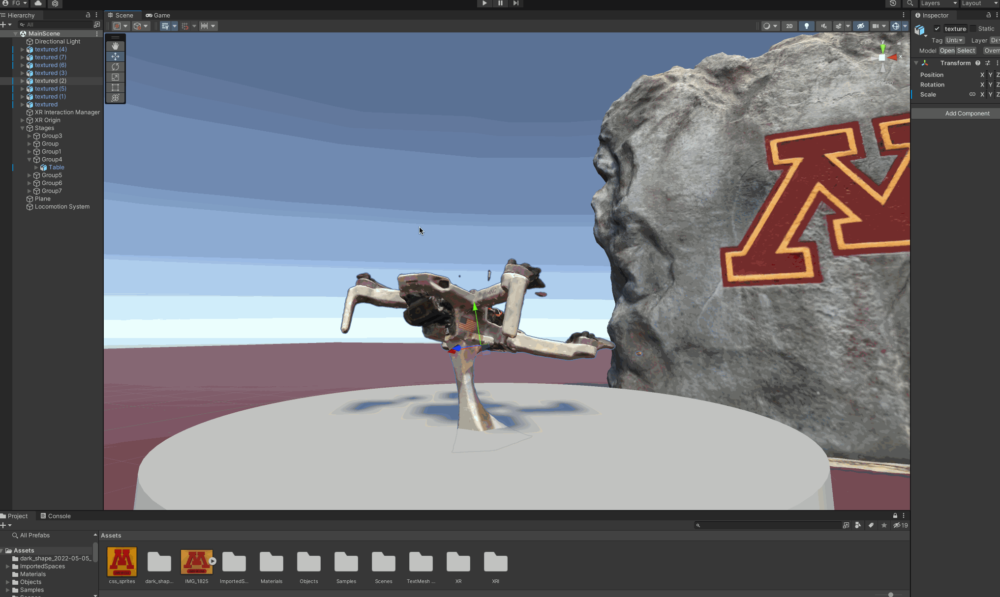

# Goldstein Museum of Design Photogrammetry VR Tour App

###### READMEv4.3

Try the WebXR Build on a SteamVR headset!
[https://UMN-VR.github.io/WebGL_Demo](https://umn-vr.github.io/WebGL_Demo/)
(tecnicaly runs on a quest 2, but not optimized)

Video of app v1.0: https://youtu.be/eQZTAWonZkg


* [Overview](#Overview)

* [Hardware](#Hardware)

* [Software](#Software)
	* [Software Checkout and Setup](#Software-Checkout-and-Setup)

* [Quest Instalation Methods & Instructions](#Quest-Instalation-Methods-&-Instructions)

* [Additional Project Components & Tecniques](#additional-project-components-&-Tecniques)
    * [ShapesXR Plugin](#ShapesXR-Plugin)
    * [Lowering polygon counts](#Lowering-polygon-counts)
    * [WebGL](#WebGL)
    * [WebXR](#WebXR)

* [Polycam](#Polycam)


* [Models](#Models)

* [Description of App Logic](#Description-of-App-Logic)

* [WebXR](#WebXR)

* [Future Work](#future-work)

* [External Links](#external-links)

## Overview
The aim of this project is to create a virtual museum inspired on a real life one. Using the same artifacts but on you and improved virtual environment. This will give the U a global reach and cement the university's position as a pioneer in virtual reality. 

#### Hardware:
At the present moment only Quest 2 native SDK app builds are being provided since the project is just at the proof of concept stage. Eventually the idea is to release a WebXR build and host it on a domain so that everyone can access it regardless of platform. 


#### Software:
The proof of concept project was created using Unity and it is likely that the same workflows and platforms will be used to eat the final product, we will just tweaking the specifics of it to improve the final result.

To open up the project all you need to do is have a current installation of:

* Unity v2021.1.3.1f1

If you want to edit 3d Models:

* Blender (Any version will work really, would recomend using latest avaliable.)

If you want to scan your own 3d Models 

* Polycam (IOs App works better, would recomend using latest avaliable.)

##### Software Checkout and Setup:

You should create a copy of this repository structured as follows

```
VR-Photogrammetry/
│
├── Goldstein-Museum-of-Design-Photogrammetry-VR-Tour-App/
│   ├── Photogrammetry Demo
│   │   └── ...
│   ├── Photogrammetry_Demo_v1.0.apk
│   │   
│   └── README.md
```
---
## Quest Instalation Methods & Instructions
This section attemps to be a full set of instructions to get a you up and running with the pre-complied .apk app

---
### WebXR 
You may go to "$URL" on a headset's browser or a PC connected to a Headset and try the experience 

(NOT AVALIABLE YET)

---

### Oculus App Lab Installation: 

(NOT AVALIABLE YET)

---
### Sidequest .apk Configuration & Installation

#### Quest Setup
* Enable Developer Mode On Quest. 

#### Installer PC Setup
* Install Sidequest on a computer. 
https://sidequestvr.com

* Download .apk file to computer
https://github.com/UMN-VR/Goldstein-Museum-of-Design-Photogrammetry-VR-Tour-App/releases/tag/Proof-Of-Concept

#### Uploading:
* Install .apk to Quest via SideQuest

#### Running:
* Go to "Other Sources in App menu"
* Open "Photogrammetry Demo" App 

---

## Polycam
Polycam is the photogrammetry app that was used to scan most of the 3D models. 


## Models
VR Blaze (GoldyDogV4)
https://youtu.be/8dp5lvD6FZA

https://poly.cam/capture/BAF1E307-5185-48E4-866D-A84A12247B99


Robot Hand & Robot Hand Glove


Robot Hand:
https://poly.cam/capture/78286198-5910-468A-AC13-7C8DE018AFB0

Robot Hand Glove:
https://poly.cam/capture/1810CB6D-5C9A-43F0-ADE3-848C0CCB610A


Mini 2:

https://poly.cam/capture/1810CB6D-5C9A-43F0-ADE3-848C0CCB610A


Air 2s With 360 camera:


RockM:


Goldy:


Quest 2:


## Description of App Logic
##### v1.0: 
App does not include any multiplayer or in game interactivity functionality is simply starts up the scene starts rendering the scene and never changes it.

## WebXR 
This is the software that allows for a unity environment to be packaged as a website plug-in that allows for a VR experience without installation of an application. 

## Additional Project Components & Tecniques 
#### ShapesXR Plugin:
Allows for direct import of models created in shapesXR. After the models have been imported it is recommended to uninstall and remove the file located in assets since failing to doing so usually means you won't be able to build successfully. 

#### Lowering polygon counts:
If performance is lackluster polygon counts can be reduced through joining close together nodes to create a mesh with a smaller filesize. You can also trim unnecessary parts of the model that take up space and don't contribute to aesthetics. This is all done in blender. 

#### WebGL:
Web GL is the render engine that allows WebXR to function. It is part of this software stack that will power the in-browser VR experience. 


## Future Work
TODO

## External Links and References
TODO

